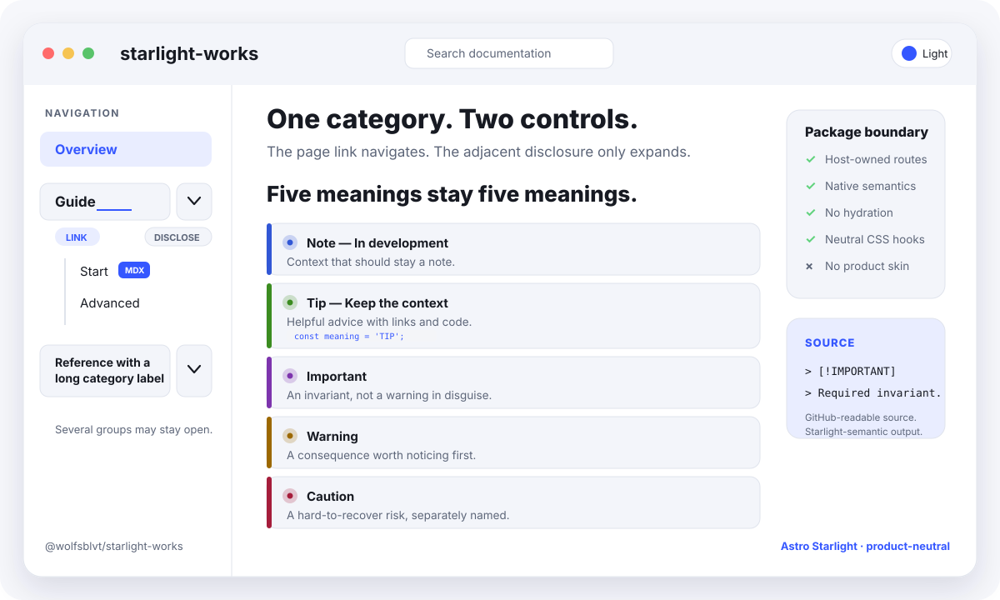

# starlight-works

[](https://github.com/Wolfsblvt/starlight-works/actions/workflows/verification.yml) [](#installation) [](docs/compatibility.md)

**A category can be a page and a group. An important note does not have to become a warning.**

`@wolfsblvt/starlight-works` adds two deliberately small capabilities to Astro Starlight: linked sidebar categories with independent disclosures, and all five GitHub Markdown alert types. It inherits your documentation site's typography and theme rather than supplying another product skin.

This is an **unpublished source package**, not an npm release. It targets Starlight `~0.42.2`, Astro `^7.2.10` and Node `>=22.12.0`. An open-source project from **Wolfsblvt Works**.

**[Installation](#installation)** · [Quick start](#quick-start) · [Full API](docs/api.md) · [Compatibility](docs/compatibility.md)

<picture>
  <source media="(prefers-color-scheme: dark)" srcset="docs/assets/readme/package-preview-dark.svg">
  <source media="(prefers-color-scheme: light)" srcset="docs/assets/readme/package-preview-light.svg">
  
</picture>

```js
starlightWorks({
  sidebar: [
    'index',
    {
      label: 'Guide', slug: 'guide', defaultOpen: true,
      items: ['guide/start'],
    },
  ],
});
```

The Guide label navigates to the Guide page. Its adjacent disclosure opens or closes the children without navigating. A current child opens its ancestors even when their defaults are closed.

## Installation

Build a local tarball from `main`. These commands do not publish anything:

```sh
git clone https://github.com/Wolfsblvt/starlight-works.git
cd starlight-works
npm install
npm test
npm run pack
```

The result is `artifacts/package/wolfsblvt-starlight-works-0.1.0.tgz`. In an existing compatible Starlight project, install that file:

```sh
npm install /absolute/path/to/wolfsblvt-starlight-works-0.1.0.tgz
```

Do not use an npm registry installation command for this package until an actual release exists. Dependency installation needs registry access; the package itself adds no network service or client-side requests.

## Quick start

Add the plugin to `astro.config.mjs`. For this example, create `src/content/docs/guide/index.md` and `src/content/docs/guide/start.md` with ordinary Starlight frontmatter and page content.

```js
import { defineConfig } from 'astro/config';
import starlight from '@astrojs/starlight';
import starlightWorks from '@wolfsblvt/starlight-works';

export default defineConfig({
  integrations: [starlight({
    title: 'Documentation',
    plugins: [starlightWorks({
      sidebar: [
        'index',
        {
          label: 'Guide',
          slug: 'guide',
          defaultOpen: true,
          items: ['guide/start'],
        },
      ],
    })],
  })],
});
```

Configure this sidebar in **one place**: move it out of `starlight.sidebar` and into `starlightWorks({ sidebar })`. Do not combine the linked-sidebar feature with another `Sidebar` override. Omitting the plugin's `sidebar` option leaves native navigation in place and enables only the alert feature.

Add this ordinary Markdown to a documentation page:

```md
> [!NOTE]
> **In development**
> Read the guide before relying on this behavior.
```

Start the consuming site's normal development command. The sidebar should show Guide as a link beside a separate disclosure, and the alert should read **Note — In development**. The same source remains readable on GitHub.

For a ready-made example rather than your own site, run `npm run test:consumer` and then `npm run dev` in this repository. Open `http://127.0.0.1:4321/manual/`; the fixture installs the actual tarball into a separate temporary project.

## What it does

**Linked categories.** Nested groups, native links and slugs, badges, translations and Starlight autogeneration remain available. Groups open independently; current ancestry wins over initial defaults. Native disclosures support keyboard activation and do not require hydration or browser storage.

**Five alert meanings.** `NOTE`, `TIP`, `IMPORTANT`, `WARNING` and `CAUTION` each have their own semantic label, class, data attribute and styling token. A standalone first bold title is preserved alongside the meaning. Links, lists, code and MDX content remain content; ordinary quotations and unsupported markers are not flattened into alerts.

**Your site's design.** Structural CSS uses Starlight's theme values. [Style tokens](docs/api.md#styling) let the consumer adjust spacing and each alert accent without replacing the package or inheriting a product brand.

## Boundaries

This is not a Starlight fork, a theme, a route registry or a Markdown sanitizer. It adds no tracking, client-side framework, storage, publication or deployment machinery. Open states reset to defaults/current ancestry on a new page render; cross-visit persistence is deliberately absent.

Satteri and Unified are the supported Markdown processors. Other processors can use the sidebar with `alerts: false`. See [compatibility and qualification](docs/compatibility.md) for the exact matrix and unobserved boundaries; a passing fixture is not a claim about every browser, screen reader, locale or plugin combination.

## Documentation, development and contribution

The [API](docs/api.md) owns configuration, content syntax, styles and failure behavior. [Development](docs/DEVELOPMENT.md) gives the full test, packed-consumer, browser and cleanup paths. [Architecture](docs/ARCHITECTURE.md) explains the public integration boundaries, while [dependencies](docs/dependencies.md) records why the small dependency set exists and how licenses are handled.

Report reproducible package problems through [repository issues](https://github.com/Wolfsblvt/starlight-works/issues). Contributions should preserve the two-capability boundary and include a packed-consumer test for changed integration behavior. Public source does not promise feature acceptance or a response-time guarantee.

## License

Licensed under [MIT](LICENSE), allowing use, modification and redistribution with the license notice retained.
